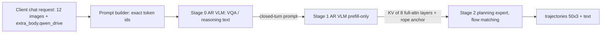

# Architecture (target)

## Files to create (paths relative to repo root)
- `vllm_omni/model_executor/models/qwen_drive/{__init__,qwen_drive_vlm,pipeline}.py`
- `vllm_omni/model_executor/stage_input_processors/qwen_drive.py`
- `vllm_omni/diffusion/models/qwen_drive/{__init__,pipeline_qwen_drive,planning_expert}.py`
- `vllm_omni/deploy/qwen_drive_{vqa,plan}.yaml`
- registry entries in `vllm_omni/model_executor/models/registry.py`, `vllm_omni/diffusion/registry.py`, `vllm_omni/config/pipeline_registry.py`
- KV layer filter in `vllm_omni/distributed/omni_connectors/kv_transfer_manager.py` (+ AR model runner callers)
- tests under `tests/diffusion/models/qwen_drive/`, `tests/model_executor/stage_input_processors/`, `tests/e2e/online_serving/test_qwen_drive.py`

Update this page as the implementation diverges from the plan.
