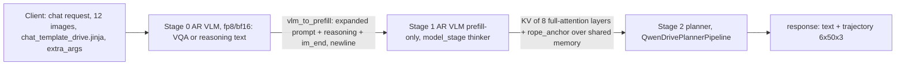

# Architecture (as implemented)

Routing: `modalities=["text"]` stops after stage 0; `["trajectory"]` runs all stages; `["text","trajectory"]` returns both.

## Code map (repo-relative)
- VLM stage: `vllm_omni/model_executor/models/qwen_drive/qwen_drive_vlm.py` (subclass of vLLM `Qwen3_5ForConditionalGeneration`; strips `vlm.`; records the last mRoPE position per request -> `rope_anchor` via `get_kv_transfer_metadata`), registry `vllm_omni/model_executor/models/registry.py`.
- Config flattening: `OmniEngineArgs._flatten_nested_hf_config` (`vllm_omni/engine/arg_utils.py`): the checkpoint's `vlm_config` becomes the stage HF config (temp dir via `hf_config_path`); no custom config class, `trust_remote_code` optional.
- Topology: `vllm_omni/model_executor/models/qwen_drive/pipeline.py` (registered in `vllm_omni/config/pipeline_registry.py`); bridges `vllm_omni/model_executor/stage_input_processors/qwen_drive.py` (`vlm_to_prefill`, `prefill_to_planner`); deploy `vllm_omni/deploy/qwen_drive{,_fp8}.yaml`.
- KV transfer changes: `kv_layer_indices` filter (`vllm_omni/distributed/omni_connectors/kv_transfer_manager.py`); attention-group block ids for hybrid models (`vllm_omni/core/sched/omni_ar_scheduler.py`).
- Planner: `vllm_omni/diffusion/models/qwen_drive/{planning_expert,pipeline_qwen_drive}.py`; registry `vllm_omni/diffusion/registry.py`, output type `vllm_omni/diffusion/model_metadata.py`.
- API: `trajectory` field in `vllm_omni/entrypoints/openai/protocol/chat_completion.py`, branch in `serving_chat.py` (non-streaming).
- Tests: `tests/diffusion/models/qwen_drive/`, `tests/e2e/online_serving/test_qwen_drive.py`.
- Tooling (not shipped): `customs/qwen_drive/` (docker, golden, export, client, serve, spikes).
